# Red Team Training Tracker (RT3)

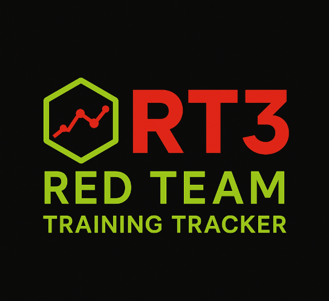

RT3 is a comprehensive training management system designed for Red Team operations. It tracks JQR (Job Qualification Record) tasks, team roster management, training progress, assessments, missions, and provides detailed reporting capabilities for operators at different skill levels.

Disclaimer - This application is purpose built for specific conditions. Feel free to fork and modify as you deem necessary.

## Features

### Team Roster Management
- **Operator Profiles**: Track operator information including name, handle, team roles, onboarding date, operator level, compliance status, and active status
- **Avatar Management**: Upload and manage operator profile pictures
- **Role-based Access**: Different views and permissions based on operator level

### Mission Tracking
- **Mission Creation**: Define and organize training missions with detailed information
- **Year-based Organization**: Missions are automatically grouped by year for easy navigation
- **Operator Assignment**: Assign remote and local operators to missions
- **On Keyboard Tracking**: Mark which operators were actively on keyboard during missions
- **Mission Documentation**: Upload and manage mission-related documents

### JQR (Job Qualification Record) Management
- **Task Management**: Create and manage JQR tasks for different skill levels (Apprentice, Journeyman, Master)
- **Task Assignment**: Automatically assigns tasks based on operator levels
- **Progress Tracking**: Track completion status, signatures, and dates for each task
- **Sync Functionality**: Automatically syncs JQR tasks with team roster changes
- **Bulk Operations**: Support for bulk editing and trainer signatures

### Training Management
- **Red Team Training**: Track required training and certifications
- **Vendor Training**: Manage external training records
- **Certification Tracking**: Monitor certification status and expiration dates
- **Document Management**: Upload and view training documents
- **Training Types**: Categorized training types for better organization

### Assessment System
- **Create Assessments**: Design and build training assessments with multiple question types
- **Question Categories**: Organize questions by categories for better structure
- **Track Progress**: Monitor assessment completion and results
- **View Responses**: Review detailed assessment responses with grading capabilities
- **Grading System**: Support for automated and manual grading

### Reporting System
- **Annual Red Team Training Report**: Comprehensive report showing training compliance by year
- **Quarterly Legal Briefings Report**: Track quarterly legal briefing requirements
- **Compliance Tracking**: Monitor training completion rates and compliance status
- **Export Functionality**: Export reports as text for external use

### Backup and Maintenance
- **Automated Backups**: Automatic backups of database and uploads every 6 hours
- **Cron Integration**: Built-in cron job setup - no manual configuration required
- **Configurable Storage**: Set custom backup directory via environment variable
- **Retention Policy**: Keeps 28 most recent backups (7 days × 4 backups/day)
- **Data Protection**: Secure backup storage with timestamped archives

### User Interface
- **Dark Mode Support**: Full dark mode theme with proper color theming
- **Responsive Design**: Works on desktop and mobile devices
- **Material-UI Components**: Modern, accessible UI components
- **Real-time Updates**: Live data updates without page refresh

## Technical Stack

- **Backend**: FastAPI (Python), SQLAlchemy ORM, SQLite Database, JWT Authentication
- **Frontend**: React, Material-UI (MUI), React Router, Axios
- **Infrastructure**: Docker, Docker Compose, Nginx
- **Database**: SQLite (with PostgreSQL support)

For detailed technical information, see:
- [Backend Documentation](backend/README.md) - API endpoints, database schema, development setup
- [Frontend Documentation](frontend/README.md) - Component structure, development guidelines

## Prerequisites

- Docker
- Docker Compose
- Git

## Configuration

### Backup Directory

You can configure where backups are stored by setting the `RT3_BACKUP_DIR` environment variable. If not set, backups will be stored in `./backup` relative to the rt3 directory.

**Option 1: Using .env file (recommended)**
```bash
# Copy the example environment file
cp .env.example .env

# Edit .env and set your backup directory
RT3_BACKUP_DIR=/path/to/your/backup/directory
```

**Option 2: Using environment variable**
```bash
export RT3_BACKUP_DIR=/path/to/your/backup/directory
docker compose up -d
```

**Examples:**
- `RT3_BACKUP_DIR=./backup` - Store backups in the rt3 directory (default)
- `RT3_BACKUP_DIR=/opt/rt3-backups` - Store backups in an external directory
- `RT3_BACKUP_DIR=/mnt/backup-storage/rt3` - Store backups on a separate storage device

## Quick Start

1. Clone the repository:
```bash
git clone [repository-url]
cd RT3
```

2. (Optional) Configure backup directory and LDAP authentication:
```bash
# Copy the example environment file
cp env.example .env

# Edit .env and configure your settings:
# - Backup directory: RT3_BACKUP_DIR=/path/to/your/backup/directory
# - LDAP authentication: See LDAP_CONFIGURATION.md for detailed instructions
# - SSL certificates: Configure LDAP_CA_CERT_FILE for LDAPS connections
```

3. Start the application:
```bash
# For development
docker compose up --build [-d]

# For production
docker compose -f docker-compose.yml -f docker-compose.prod.yml up --build [-d]
```

If running in development, the application will be available at:

- Web Application: https://localhost (HTTPS with auto-generated certificates)
- Direct Frontend: http://localhost:3000
- Backend API: http://localhost:8000
- API Documentation: http://localhost:8000/docs

### SSL Certificates

RT3 automatically generates self-signed SSL certificates for localhost when no certificates are provided. This allows immediate HTTPS access without manual certificate setup.

**Automatic Certificate Generation:**
- Certificates are generated on first startup if `nginx/certs/cert.pem` and `nginx/certs/key.pem` don't exist
- Self-signed certificates are valid for 365 days
- Certificates are generated for `localhost` domain
- Suitable for development and testing environments

**Using Your Own Certificates:**
To use your own SSL certificates:
1. Place your certificate files in `nginx/certs/`:
   - `cert.pem` - Your SSL certificate
   - `key.pem` - Your private key
2. Restart the nginx container: `docker compose restart nginx`

**Production Deployment:**
For production environments, replace the auto-generated certificates with proper SSL certificates from a trusted Certificate Authority.

### Default Login Credentials

The application creates a default admin user on first startup:
- **Username**: `admin`
- **Password**: `admin`

**Important**: Change the default password after your first login for security.

### Stopping the Application

```bash
# Stop all containers
docker compose down
```

## Database Management

```bash
# Access SQLite database
docker compose exec backend sqlite3 /app/data/rt3.db

# Database Migrations
docker compose exec backend alembic upgrade head
```

For detailed database management commands, see [Backend Documentation](backend/README.md#database-management).

## Backup Management

Backups are automatically created every 6 hours via cron job to the location specified in your `.env` file, or the `rt3/backup` folder by default. No manual setup is required.

```bash
# Manual backup (if needed)
docker compose exec backend /opt/rt3/utils/backup_rt3.sh

# View backup logs
docker compose exec backend cat /app/backup/backup.log

# View cron logs
docker compose exec backend cat /app/backup/cron.log

# Check cron job status
docker compose exec backend service cron status
```

**Backup Configuration:**
- **Schedule**: Every 6 hours (0, 6, 12, 18)
- **Retention**: 28 most recent backups (7 days × 4 backups/day)
- **Contents**: Database file and uploads directory
- **Location**: Configurable via `RT3_BACKUP_DIR` environment variable

For detailed backup management, see [Backend Documentation](backend/README.md#backup-management).

## Authentication

RT3 supports two authentication methods:

### Local Authentication (Default)
- Username/password stored in the local database
- Users created and managed within RT3
- Default authentication method

### LDAP Authentication (Optional)
- Authenticate against LDAP/Active Directory servers
- Automatic user account creation for LDAP users
- Configurable user filtering and attribute mapping
- Falls back to local authentication if LDAP fails

For detailed LDAP configuration instructions, see [LDAP Configuration Guide](LDAP_CONFIGURATION.md).

## Troubleshooting

### Common Issues

1. **Database Connection Issues**
   - Ensure the data volume is properly mounted
   - Check database file permissions
   - Verify database migrations are up to date

2. **Frontend Not Loading**
   - Check frontend container logs: `docker-compose logs frontend`
   - Verify API URL in docker-compose.yml
   - Ensure backend is running: `docker-compose ps`

3. **Backend API Issues**
   - Check backend logs: `docker-compose logs backend`
   - Verify database connection
   - Check API documentation at http://localhost:8000/docs

4. **File Upload Issues**
   - Verify upload directory permissions
   - Check file size limits
   - Ensure proper file type validation

5. **Backup Issues**
   - Check backup logs: `docker compose exec backend cat /app/backup/backup.log`
   - Check cron logs: `docker compose exec backend cat /app/backup/cron.log`
   - Verify cron service is running: `docker compose exec backend service cron status`

For detailed troubleshooting, see:
- [Backend Documentation](backend/README.md#common-issues)
- [Frontend Documentation](frontend/README.md#common-issues)

### Logs

```bash
# View all logs
docker compose logs

# View specific service logs
docker compose logs frontend
docker compose logs backend
docker compose logs nginx
```

## Contributing

1. Fork the repository
2. Create a feature branch
3. Commit your changes
4. Push to the branch
5. Create a Pull Request

For development guidelines, see:
- [Backend Development](backend/README.md#development)
- [Frontend Development](frontend/README.md#development)

## API Documentation

For detailed API documentation, see [backend/README.md](backend/README.md) for comprehensive endpoint documentation, request/response schemas, and usage examples.

## Images

### Dashboard

| 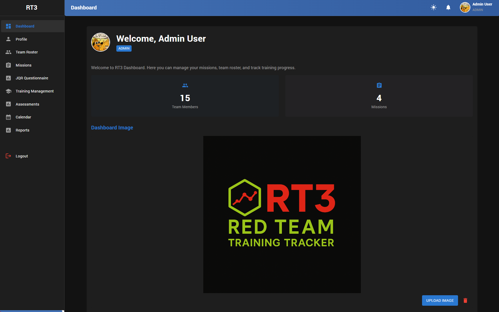 | 
|:--:| 
| *RT3 Main Dashboard* |

### Team Roster

| 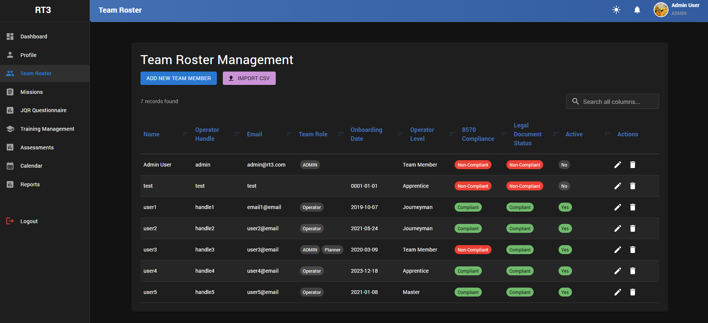 | 
|:--:| 
| *Team Roster Management* |

### Missions

| 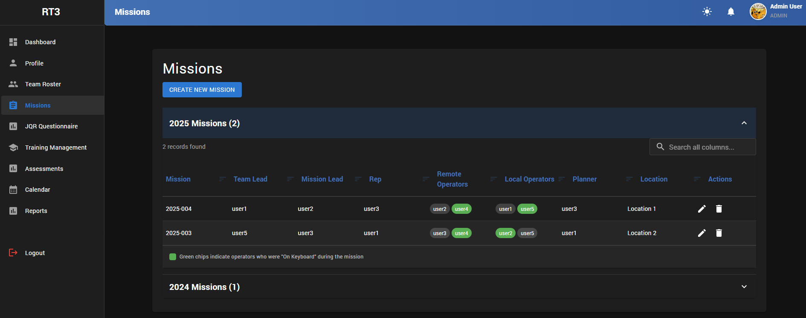 | 
|:--:| 
| *Mission Management* |

### JQR Questionnaire

| 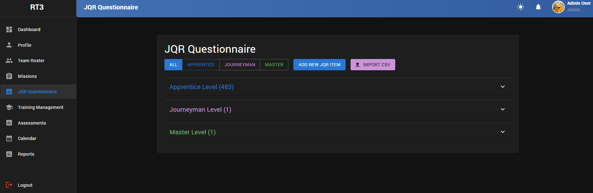 | 
|:--:| 
| *JQR Questionnaire Management - List* |

| 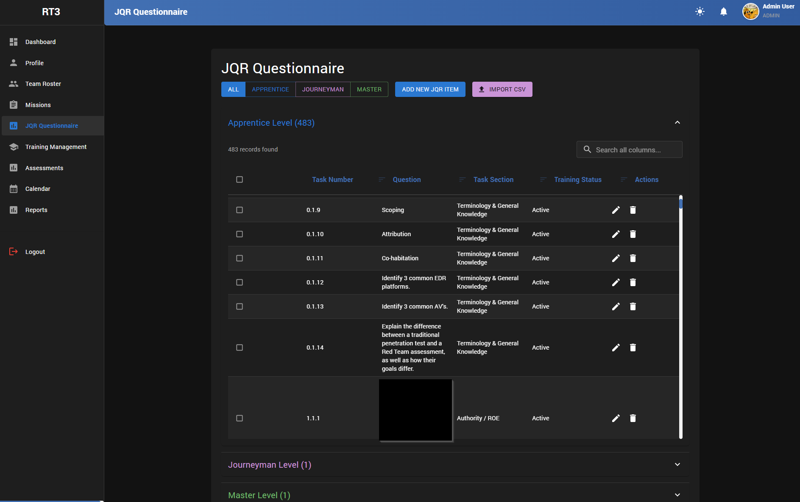 | 
|:--:| 
| *JQR Questionnaire Management - Expanded View* |

### Training Management

| 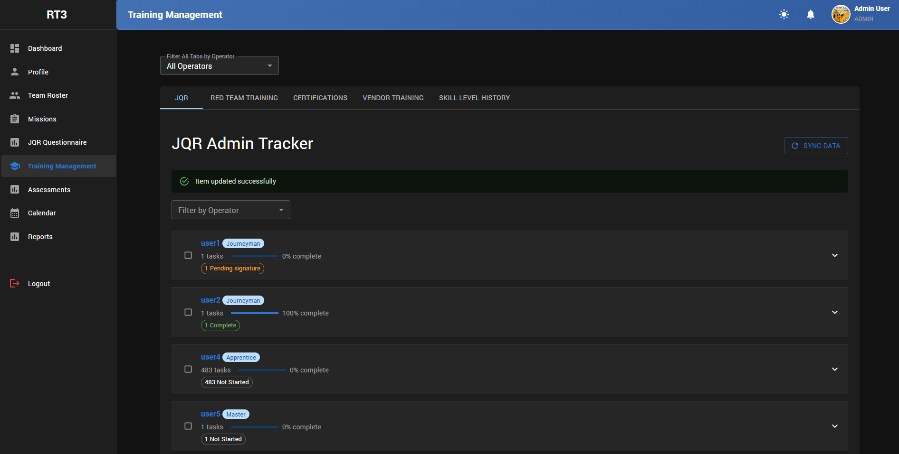 | 
|:--:| 
| *Training Management - JQR List* |

| 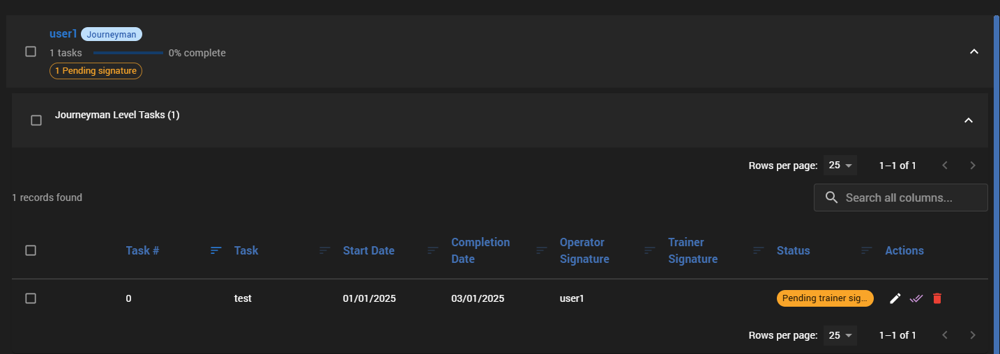 | 
|:--:| 
| *Training Management - JQR - Operator Signed Task, Pending Trainer Signature* |

| 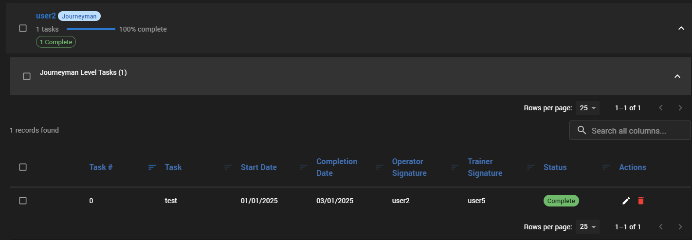 | 
|:--:| 
| *Training Management - JQR - Operator and Trainer Signed Task* |

| 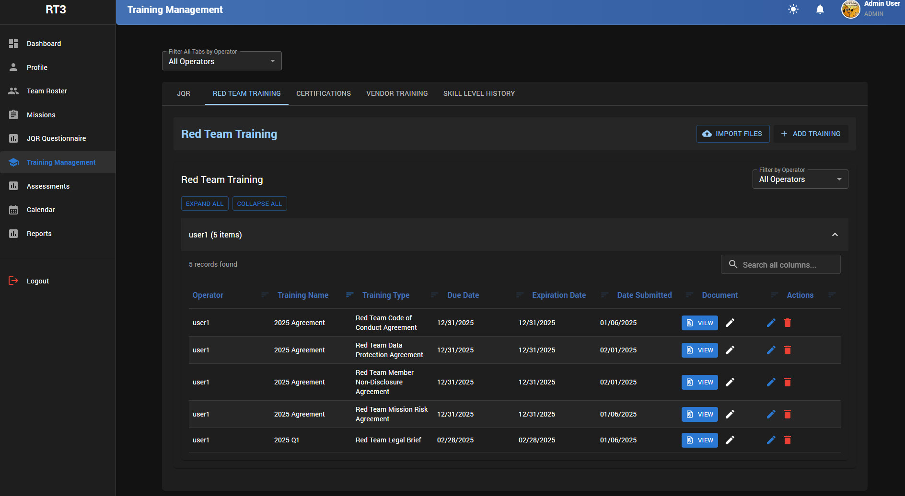 | 
|:--:| 
| *Training Management - Red Team Specific Training* |

| 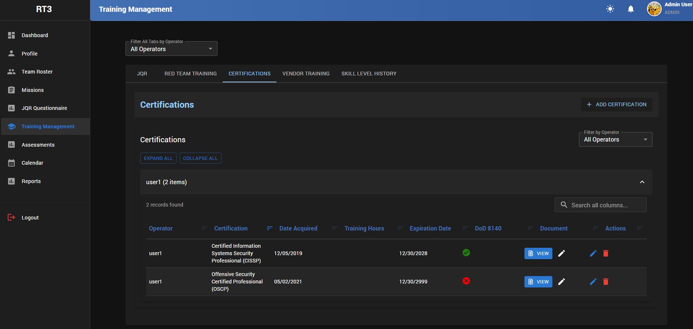 | 
|:--:| 
| *Training Management - Certifications* |

| 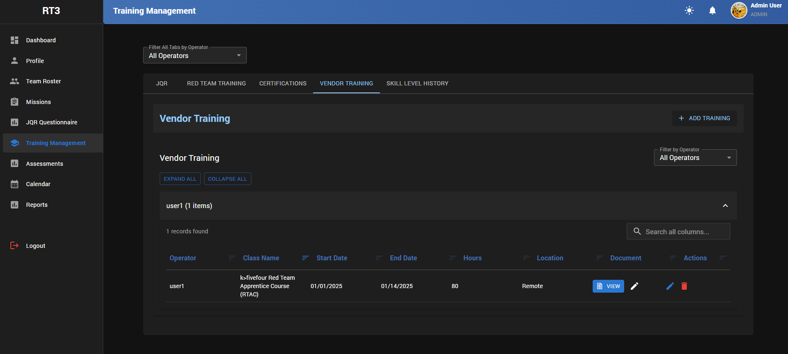 | 
|:--:| 
| *Training Management - Vendor Training* |

| 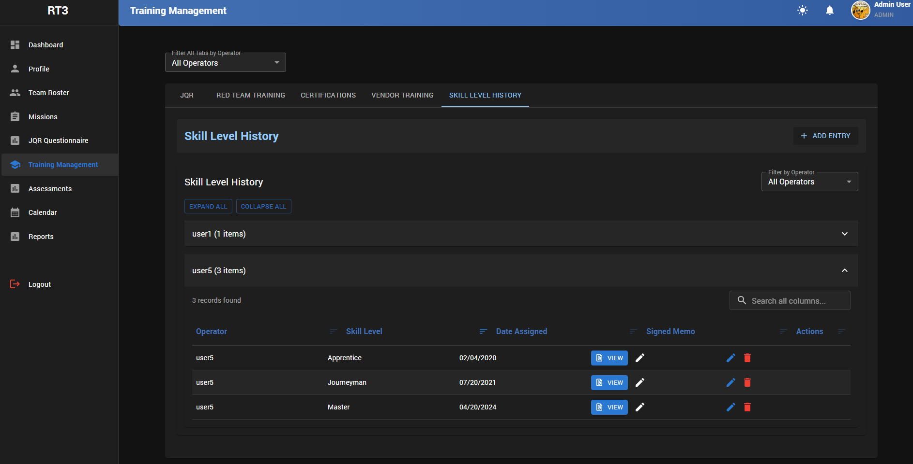 | 
|:--:| 
| *Training Management - Skill Level Documentation* |

### Assessments

| 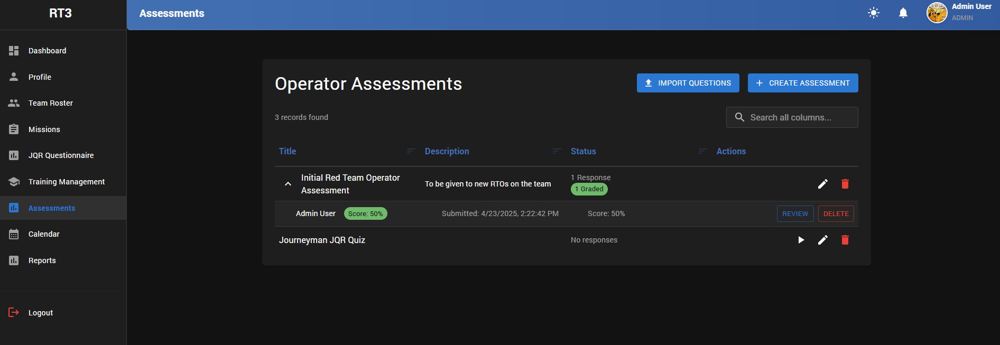 | 
|:--:| 
| *Assessments - List* |

| 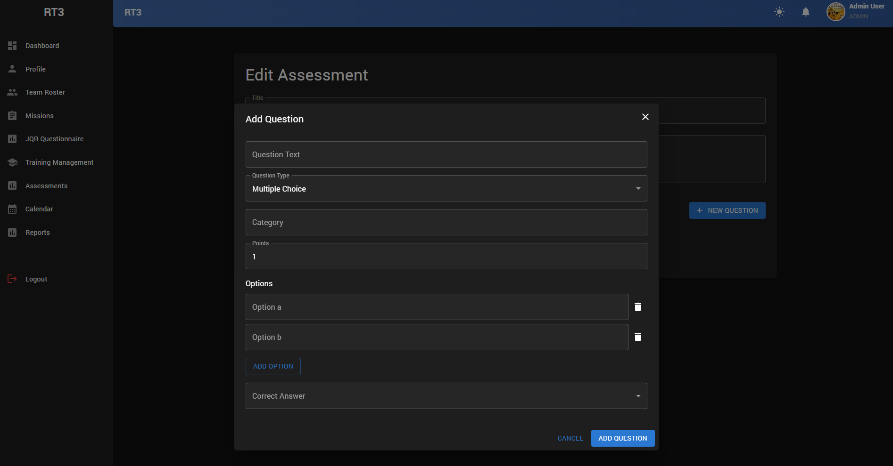 | 
|:--:| 
| *Assessments - New Assessment/Add Question View* |

| 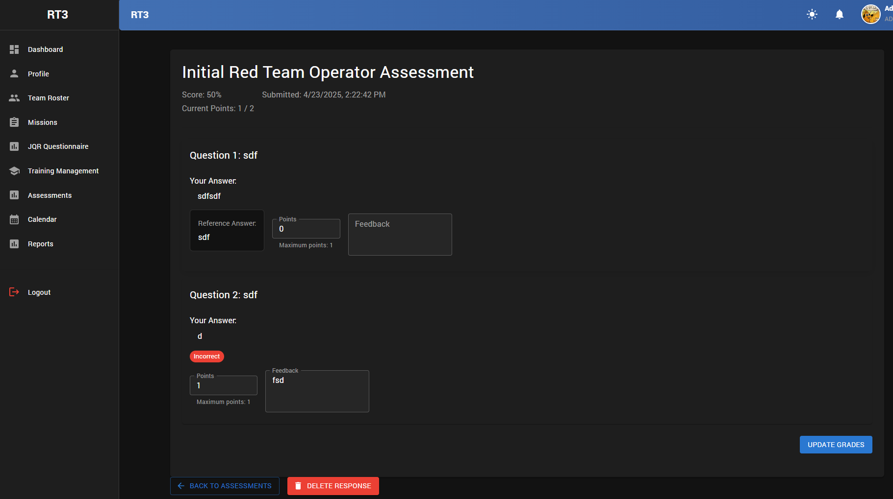 | 
|:--:| 
| *Assessments - Grading Submitted Assessment View* |

### Calendar

*TBD*

### Reports

| 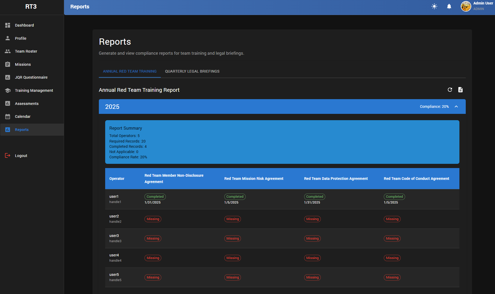 | 
|:--:| 
| *Reports - Annual Red Team Training Compliance* |

| 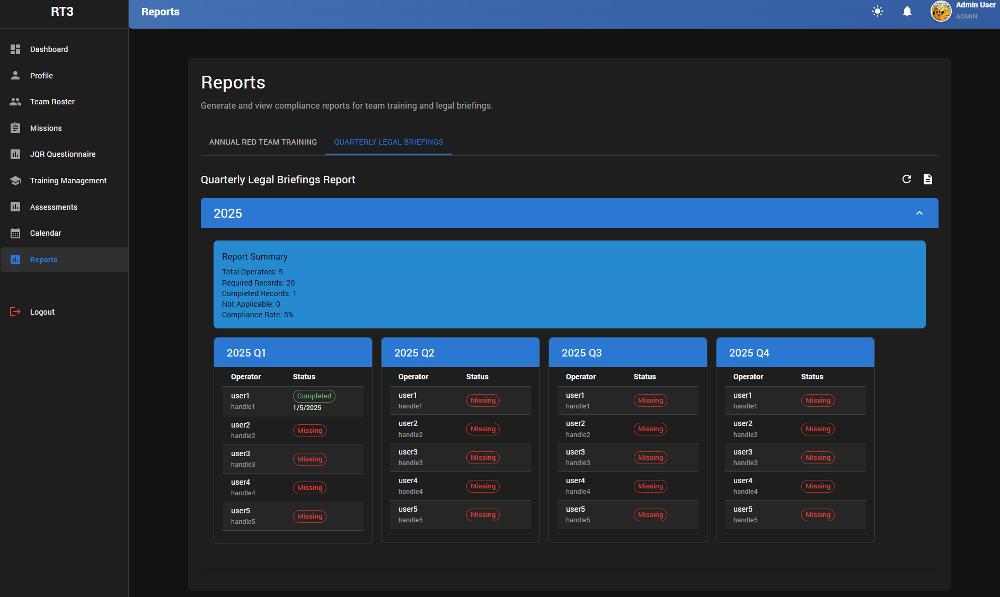 | 
|:--:| 
| *Reports - Quarterly Legal Briefing Compliance* |
